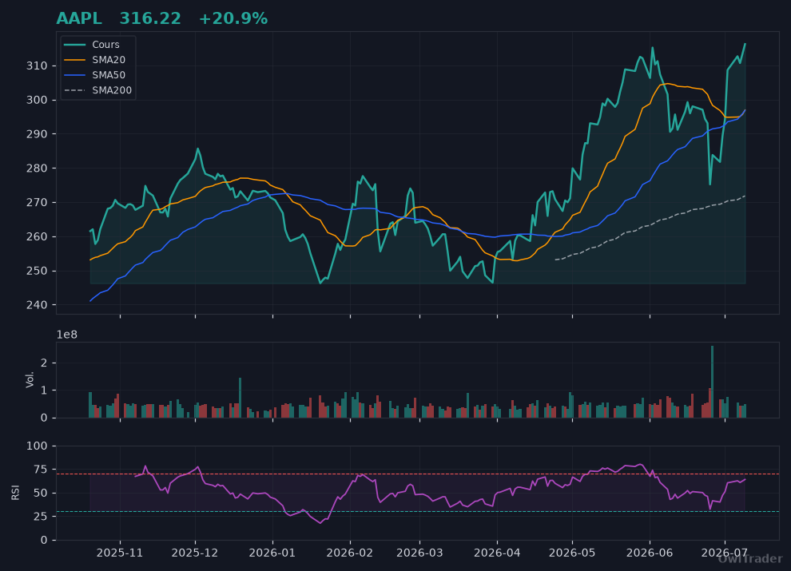
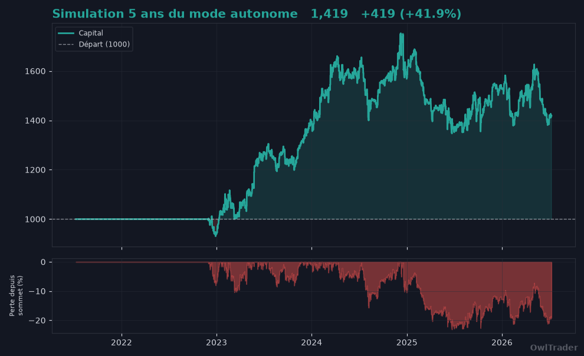

<div align="center">

# 🦉 OwlTrader

**Un desk de trading complet dans Telegram — gratuit et open source. Il scanne tout le S&P 500, trade en autonome (fictif ou via Alpaca), et un conseiller IA optionnel pilote le robot avec un plan de trade quotidien.**

[English](README.md) · [Français](README.fr.md)


</div>

> ⚠️ **Outil éducatif. Aucun conseil financier.** Par défaut, OwlTrader trade avec de l'argent **fictif** (simulateur interne ou compte *paper* Alpaca gratuit). Un mode réel existe via Alpaca — à activer en pleine connaissance de cause, à tes risques.

---

## 📸 Aperçu

| Analyse d'un actif (`/graph`) | Courbe de capital (`/bilan`, `/simuler`) |
|---|---|
|  |  |

Graphiques **thème sombre pro** (style TradingView) : prix + variation en titre, dégradé sous le cours, volume, RSI, et sous-graphe de drawdown (le « vécu » du risque). Simulation 5 ans du mode autonome au moment d'écrire : **1000 € → ~1420 € (+42 %)**, frais de courtage inclus — les fenêtres bougent, relance `/simuler` pour le chiffre du jour.

---

## ✨ Ce qu'il fait

### 🤖 Trading autonome
- **Scanne TOUT le S&P 500** (≈503 actions, liste **remise à jour chaque semaine** automatiquement) + tes cryptos, et achète les plus fortes (classement momentum).
- **Paper-trading interne** (argent fictif, frais inclus) **ou exécution réelle via [Alpaca](https://alpaca.markets)** (compte *paper* gratuit d'abord, mode réel optionnel) — le bot passe ses ordres seul, toutes les heures.
- **Anti-bagotement de niveau pro** (pratiques de freqtrade) : décisions uniquement sur **bougies clôturées**, aucun ordre quand le marché de l'actif est **fermé** (US 9h30–16h NY, Europe 9h–17h30 Paris, crypto 24/7).
- Risque : stop-loss automatique, filtre de régime (S&P > MM200), dimensionnement par volatilité, momentum absolu.

### 🧠 Conseiller IA (optionnel, OpenAI)
- Agrège **tout** le contexte (positions, indicateurs, régime macro cross-actifs, actus RSS, coûts) et rend un avis tranché.
- **Osmose IA ↔ robot** : l'IA est le *chef de desk* — elle émet un **plan de trade 24 h** (biais agressif/défensif, actifs à privilégier/éviter) que le cycle autonome applique à chaque passage horaire.
- Ses achats sont **protégés 7 jours** du cycle autonome (elle seule peut les revendre) — fini les allers-retours stériles entre les deux cerveaux.
- **Chasse globale** : via les actus, l'IA peut découvrir et faire acheter des actions **hors** de ta liste.
- Budget maîtrisé : 1 consultation automatique/jour (en pleine séance US, jamais marché fermé) ; le bouton manuel est illimité.

### 🎛️ Cockpit & urgence (UX inspirée de Maestro/Trojan et freqtrade)
- `/cockpit` — **tableau de bord vivant** : équity + sparkline `▁▂▄▆█`, cartes de positions avec barres de P&L `🟩🟩🟩⬜⬜`, plan IA actif, bouton **🔄 Actualiser** qui met la carte à jour *sur place*.
- `/stopachats` — **frein à main** : plus aucun achat (robot + IA), ventes et stop-loss toujours actifs. `/reprendre` pour relancer.
- `/toutvendre` — liquidation totale avec confirmation.
- `/paractif` (P&L réalisé par actif) · `/jours` (gains/pertes par jour).

### 📊 Analyse & marché
- **Données multi-sources gratuites** (Yahoo Finance, CoinGecko, Stooq) — garde toujours la cotation la plus fraîche, repli automatique.
- Indicateurs : RSI, MACD, moyennes mobiles, Bollinger, ATR, ADX, golden/death cross…
- `/apercu` — briefing complet : tendance, régime, **macro cross-actifs** (RSP/SPY, HYG/LQD…), risque géopolitique (VIX), saisonnalité, top opportunités.
- Backtests avec métriques pro : Sharpe, Sortino, Calmar, CAGR, drawdown max, profit factor.
- Actus RSS agrégées + sentiment, alertes de prix.

### 🔌 Brokers & sécurité
- Hub `/brokers` : **Alpaca** (autonome, paper/réel), **Trade Republic** (lecture seule : cash, positions), **100+ échanges crypto** via CCXT.
- **Secrets chiffrés** (AES/Fernet) en base, messages contenant des clés **supprimés du chat**, accès **protégé par mot de passe**, journal d'audit + détection d'intrusion (`/securite`).
- Bilingue 🇫🇷/🇬🇧 (`/langue`), tourne 24/7 (systemd), sauvegardes quotidiennes.

## 📖 Documentation

- 🛠️ [Tutoriel d'installation & configuration](docs/INSTALL.md)
- 🤖 [Référence complète des commandes (EN/FR)](docs/COMMANDS.md)

---

## 🧠 La stratégie (et pourquoi lui faire confiance)

OwlTrader n'est **pas** une boîte noire bourrée de 50 variables magiques. Chaque règle est **éprouvée**, et tout ce qui ne survit pas à un test rigoureux hors-échantillon (5 ans **et** 10 ans) est **jeté** — coupe-circuit, trailing stop et filtres saisonniers ont été testés puis rejetés pour cette raison.

Il s'appuie sur les épaules de traders légendaires :

| Règle | Inspirée par |
|-------|--------------|
| 📈 Ensemble suiveur de tendance | Jesse Livermore / Ed Seykota |
| 🛡️ Filtre de régime (n'acheter que si le S&P > sa moyenne 200 jours) | Paul Tudor Jones |
| ⚖️ Dimensionnement par volatilité | Ray Dalio |
| 🎯 Classement par momentum relatif + absolu | Jegadeesh-Titman / Gary Antonacci |
| ✂️ Stop-loss, laisser courir les gagnants | Ed Seykota |
| 🕯️ Décisions sur bougies clôturées, jamais marché fermé | freqtrade (`process_only_new_candles`) |

**Validé sur ~98 ans** d'historique du S&P 500 (depuis 1927, à travers tous les grands krachs) et sur des fenêtres de 3/5/10 ans.

> Le vrai avantage n'est pas une formule secrète — c'est la **discipline** de tout tester et de ne garder que ce qui est robuste.

---

## 🚀 Démarrage rapide

```bash
git clone https://github.com/mkl159/owltrader.git
cd owltrader
python3 -m venv .venv && source .venv/bin/activate
pip install -r requirements.txt

# Essai immédiat, sans Telegram :
python -m src.cli analyse STOCK:AAPL

# Lancer le bot :
cp .env.example .env        # ajoute ton TELEGRAM_BOT_TOKEN (via @BotFather)
python -m src.main
```

Ensuite, dans Telegram : `/start` → le menu te guide. Pour le trading autonome réel-fictif sur Alpaca et le conseiller IA, suis le [tutoriel](docs/INSTALL.md).

### Le faire tourner en 24/7

```bash
sudo bash deploy/install-systemd.sh    # démarre au boot, redémarre seul en cas de crash
```

---

## 🤖 Commandes Telegram (essentielles)

| | |
|---|---|
| 🎛️ `/cockpit` | Tableau de bord vivant (positions, P&L, plan IA, actualisation sur place) |
| 📊 `/apercu` | Briefing complet du marché (tout en un coup d'œil) |
| 🤖 `/auto 1000` | Mode autonome interne avec 1000 € fictifs |
| 🦙 `/alpaca` | Trading autonome sur ton compte Alpaca (paper/réel) + bilan graphique |
| 🧠 `/ia` | Conseiller IA : avis, ordres exécutés, plan 24 h pour le robot |
| 🧪 `/simuler` | Backtest + métriques pro |
| 🛑 `/stopachats` · `/toutvendre` | Frein à main · liquidation totale (confirmée) |
| 📈 `/analyse AAPL` · `/graph AAPL` | Analyse & graphique pro d'un actif |
| 📊 `/paractif` · `/jours` | P&L par actif · P&L par jour |
| 🔌 `/brokers` | Hub brokers : Alpaca, Trade Republic, échanges crypto |
| 🛡️ `/securite` | Tableau de bord sécurité + journal d'audit |

[→ Référence complète des commandes](docs/COMMANDS.md) — tout est aussi accessible via des menus à boutons (`/menu`).

---

## 🆓 100 % gratuit

Fonctionne **sans aucune clé payante** (yfinance, CoinGecko, Stooq, flux RSS). Les clés optionnelles sont gratuites (Alpaca paper) ou à ta charge (OpenAI pour le conseiller IA — ~1 requête/jour).

## 🙏 Sources & inspirations

- **Données** : [Yahoo Finance](https://finance.yahoo.com) (via yfinance), [CoinGecko](https://www.coingecko.com), [Stooq](https://stooq.com), flux RSS publics, [liste S&P 500](https://github.com/datasets/s-and-p-500-companies).
- **Exécution** : [Alpaca](https://alpaca.markets) (API paper/live), [CCXT](https://github.com/ccxt/ccxt), [pytr](https://github.com/pytr-org/pytr) (Trade Republic, lecture).
- **Pratiques anti-bagotement & commandes d'urgence** : [freqtrade](https://www.freqtrade.io) (`process_only_new_candles`, protections, `/stopentry`, `/forceexit`, `/performance`, `/daily`).
- **UX des cartes de positions** : les bots Telegram [Maestro](https://www.maestrobots.com/) / Trojan (panneaux vivants, P&L visuel).
- **Régime macro cross-actifs** : inspiré d'[agentic-trading-desk](https://github.com/Oft3r/agentic-trading-desk).

## 📜 Licence

[MIT](LICENSE) — libre d'utilisation, de modification et de partage.

---

<div align="center">
<sub>Construit avec discipline, pas avec du hype. ⚠️ Éducatif — tu restes responsable de tes décisions.</sub>
</div>
